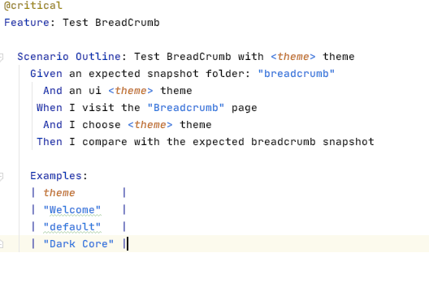
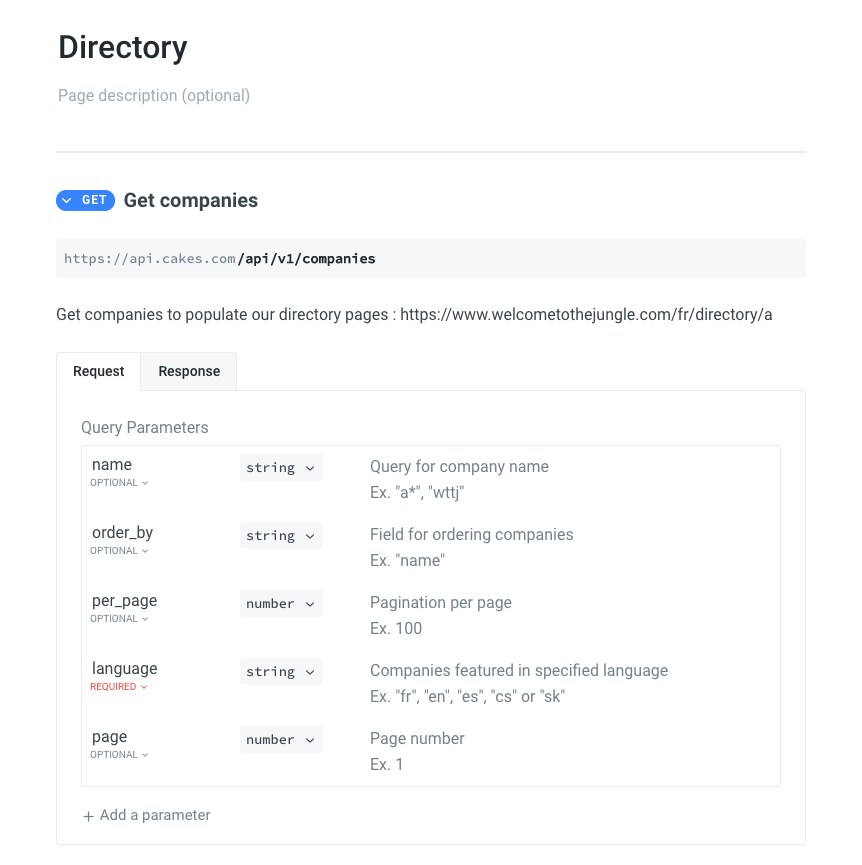

# Welcome-bits

 
 

**Welcome, dear \<reader>!**

**Every two weeks we, the engineering team at Welcome to the Jungle, will share news about our tech products, as well as details about the technical topics we’ve been working on. Our newsletter, called Welcome Bits, will also include a curated list of the most interesting links we’ve found out there on the wild wild web.**

What is Welcome to the Jungle?

<a href="https://www.welcometothejungle.com/en">Welcome to the Jungle</a> is building the new experience at work. We use content and technology to transform every step of the employee experience, to help companies offer a better, more human experience in the workplace.

Why we decided to create Welcome Bits

  
Learning and sharing knowledge is part of the engineering team’s DNA. For example, since Welcome to the Jungle launched, sessions called Jungle Labs have been organized each month so that developers in the team can spend one day away from their daily tasks to learn new stuff, grow technically, and share it all with the rest of the team (which is not always an easy exercise for the shyest among us).

So it seemed obvious to us that we should extend this learning and sharing experience to the outside world—meaning you, dear readers. And we hope you will enjoy reading about what we’ve discovered as much as we enjoy writing about it!

The engineering team behind Welcome Bits

  
The team is currently made up of 14 developers, but we’re part of a bigger team called (no prizes for guessing) “the tech team,” which also encompasses product, data, design and QA people.

Welcome to the Jungle is based in Paris, France, but 65% of us are working in full remote mode, which means that some of us can code while enjoying a beautiful view of the mountains or ocean.

The engineering team is composed of back-end, full-stack, and front-end developers, as well as one DevOps engineer and one head of engineering. We are working with Elixir, Ruby, and React JS, among other technologies (you can check <a href="https://www.welcometothejungle.com/fr/companies/wttj/tech">our full stack</a> for more details).

If you want to know more about our team, and the tech team in general, take a look at <a href="https://youtu.be/9QAV5r-sFhI">the filmed interview with Kevin</a>, our beloved CTO.

*This newsletter is a new thing for us, so your suggestions, questions, and comments are more than welcome! Just send us an issue or pull request.*

# Welcome Bits #7

## Bits of curation

1. [The Flemish Scrollers](https://twitter.com/FlemishScroller)

> A Dutch AI project that automatically tags Belgian politician using their phone. Something to extend to other countries? 

*Pierre, product manager*

2. [Flight rules for git](https://github.com/k88hudson/git-flight-rules)

> A handbook to know how to use git is always useful.

*David, back-end developer*

3. [Elixir: Practical Concurrency Cookbook](https://functional.works-hub.com/learn/elixir-practical-concurrency-3794f)

> A nice recap of the good practices to manage concurrency in Elixir.

*Stéphane, full-stack lead developer*

4. [Linear](https://linear.app/releases/2021-06)

> A promising issue tracking tool for growing companies.

*Stéphane, full-stack lead developer*

5. [LinkedIn breach reportedly exposes data of 92% of users, including inferred salaries](https://9to5mac-com.cdn.ampproject.org/c/s/9to5mac.com/2021/06/29/linkedin-breach/amp/)

> A security breach at LinkedIn that reminds us that no company is safe from such thing.

*Charles, devOps*

6. [Copilot](https://copilot.github.com/)

> THE new tool developed by GitHub that everybody is talking about.

*François, front-end developer*

## Bits of learning

"How to speak in front of an audience"

> Speaking in front of other people is difficult for many of us, no matter the number of people in front of you. The fear of being judged, of not being able to answer a question, or the fear of faltering is strong and prevents many of us from speaking in public. At WTTJ, we were lucky enough to get some public speaking training sessions which pushed us out of our comfort zone and helped us learn how to improve ourselves.

> Here are a few tips we learned from those sessions and that we wanted to share with you. Our advice is to try them one at a time!
>
> 1/ Make sure you're comfortable enough with the setup: Having the right light on you or being on camera with the right angle will help you get the confidence you need.
>
> 2/ Write key words as notes: Nobody likes to hear a speaker reading his notes with a monotonous voice. The solution is to only write key words for your notes. It will make your speech more spontaneous.
>
> 3/ Speak slowly: Giving enough space to silence (rather than saying « uh » every 10 seconds) will help bring more impact to your speech
>
> 4/ Use your hands: The use of your hands will make your speech look more alive and will give your body a chance to express itself. It will also help create a strong presence in the room.
>
> 5/ Use concise slides: Too much text in your slides will divert your audience. So make sure to be concise and to use graphic illustrations whenever possible.
>
> 6/ Tell your audience a story: Keep in mind that people memorize stories way better than facts and figures!

*Shawarma, head of engineering*

## Bits of good vibes

The company organized a party before the summer holiday. It was great and we were so happy to finally being able to see each other!

## Bits of jobs

There are currently 5 open positions in the engineering team:

- [Data engineer](https://www.welcometothejungle.com/en/companies/wttj/jobs/data-engineer_paris_WTTJ_P6qr78W)

- [Engineering manager](https://www.welcometothejungle.com/en/companies/wttj/jobs/engineering-manager_paris)

- [Full-Stack developer (Elixir, Ruby, React JS)](https://www.welcometothejungle.com/en/companies/wttj/jobs/full-stack-developer-ruby-elixir-react-js_paris)

- [Back-end developer (Elixir, Ruby)](https://www.welcometothejungle.com/en/companies/wttj/jobs/backend-developer-ruby-elixir_paris_WTTJ_9MP4PxM)

- [Senior product manager - content & membership](https://www.welcometothejungle.com/en/companies/wttj/jobs/senior-pm-content-membership_paris)

If you have any questions about the positions, send us an issue or pull request!

Thanks for reading. As we’ve said, please don’t hesitate to open an issue or pull request for any questions or comments you might have about the newsletter or one of the job vacancies. We will answer you as soon as we can.

# Archives

  

Welcome Bits #6

# Welcome Bits #6

## Bits of curation

1. [From v2.x to v3.x](https://xstyled.dev/docs/upgrade-guide/#from-v2x-to-v3x)

> A major update of xstyled, a utility-first CSS-in-JS framework built for React. This new version offers interesting features such as pseudo classes and TypeScript theme bindings.

*François, front-end developer*

2. [You’ve got to upgrade Rebar3](https://ferd.ca/you-ve-got-to-upgrade-rebar3.html)

> A useful article by Fred Hebert urging us all to upgrade Rebar3, as it turns out the SSL validation has been (accidentally) partially disabled for years!

*Stéphane, full-stack lead developer*

3. [Doctoshotgun](https://github.com/rbignon/doctoshotgun)

> A script written in Python that allows you, via the platform Doctolib, to book a Covid-vaccine appointment in France and Germany within seven days.

*Anne-Laure, tech editor*

4. [GQless](https://gqless.com)

> A new implementation of GraphQL that has come out of nowhere and seems quite promising. It’s a bit more evolved than Apollo or Relay as it’s able to deduce the query you need to implement.

*Sébastien, full-stack developer*

5. [Chaos Mesh](https://chaos-mesh.org)

> A nice tool for managing chaos engineering when using Kubernetes.

*Charles, devOps*

## Bits of learning

"Choosing mox over mocks"

> As explained by [José Valim years ago](http://blog.plataformatec.com.br/2015/10/mocks-and-explicit-contracts/), using mocks for unit testing can be problematic.
> 
> Replacing an API call with some code that sends the expected data will indeed:
> * change the behavior of an entire module, even for tests that have nothing to do with the API call
> * potentially disturb tests that are running in parallel
> * prevent developers from testing the function managing the calls
>
> That’s why Valim proposed using a different version of the module instead of replacing the function that manages the calls. For that, a contract—called “behavior” in Elixir—is created to define explicitly expected functions (the arguments and the result) and all versions of the module are committed to respect this contract. If we take the example of calls to the Twitter API, there would be two modules: one that manages real calls (let’s call it TwitterReal) and one that manages fake calls (TwitterMock). If the two modules are implementations of the same contract, TwitterReal can easily be replaced by TwitterMock anywhere it is used and tests can then be executed without having to call Twitter. Sounds nice, right?
>
> But now we can go even further thanks to [mox](https://github.com/dashbitco/mox)! This library, approved by Valim himself, adds some flexibility as it allows us to define in our module called TwitterMock a different return to the function for each test, which can be useful if you need to get 10 tweets for one of your tests and an error for another.
> 
> But please note that whether you are using mox or not, you will still need to configure a one-shot server to be able to test that the module called TwitterReal is sending HTTP calls to Twitter. For that, try using a library like [bypass](https://github.com/PSPDFKit-labs/bypass).

*Sébastien, full-stack developer*

## Bits of good vibes

Some of our developers and engineers are now trained in public speaking. We’re really looking forward to participating in some conferences and meetups soon!

## Bits of jobs

There are currently 5 open positions in the engineering team:

[Data engineer](https://www.welcometothejungle.com/en/companies/wttj/jobs/data-engineer_paris_WTTJ_P6qr78W)

[Engineering manager](https://www.welcometothejungle.com/en/companies/wttj/jobs/engineering-manager_paris)

[Full-Stack developer (Elixir, Ruby, React JS)](https://www.welcometothejungle.com/en/companies/wttj/jobs/full-stack-developer-ruby-elixir-react-js_paris)

[Back-end developer (Elixir, Ruby)](https://www.welcometothejungle.com/en/companies/wttj/jobs/backend-developer-ruby-elixir_paris_WTTJ_9MP4PxM)

[QA engineer](https://www.welcometothejungle.com/en/companies/wttj/jobs/qa-engineer_paris_WTTJ_e4jZrD7)

If you have any questions about the positions, send us an issue or pull request!

Thanks for reading. As we’ve said, please don’t hesitate to open an issue or pull request for any questions or comments you might have about the newsletter or one of the job vacancies. We will answer you as soon as we can.

  

Welcome Bits #5

# Welcome Bits #5

## Bits of curation

1. [Changes at Basecamp](https://world.hey.com/jason/changes-at-basecamp-7f32afc5)

> These changes are clearly the end of an era for the company. Basecamp has always been seen as a utopian place to work as a developer, but this is clearly not the case anymore and the huge ego of the founder seems to have won out.

*Stéphane, full-stack lead developer*

2. [Bob dishwasher cassette rewinder](https://github.com/dekuNukem/bob_cassette_rewinder)

> This GitHub repository is a great example of how a developer and a bit of elbow grease can take on the proprietary world! The author hacked a Bob dishwasher detergent cartridge because he wanted to be able to refill used ones instead of buying new cartridges. He managed to reprogram the refilled cartridge so that the dishwasher thought it was a new one.

*Maxime, back-end developer*

3. [The Instagram ads Facebook won’t show you](https://signal.org/blog/the-instagram-ads-you-will-never-see/)

> A blog post about the great ad campaign by Signal that highlights the quantity of data collected by Facebook.

*Stéphane, full-stack lead developer*

4. [Slidev](https://sli.dev)

> A promising tool created by a member of the Vue core team that generates nice slides developers can use in their presentations.

*Stéphane, full-stack lead developer*

5. [Basic telemetry for the Audacity](https://github.com/audacity/audacity/pull/835)

> A much-discussed PR for the open-source audio editor Audacity: A contributor had wanted to introduce some basic telemetry via Google Analytics and Yandex. A lot of forks were created following the PR. Hopefully the PR has now been closed, as this is the kind of change that can undermine users' trust and make an open-source project end in no time at all.

*Maxime, back-end developer*

## Bits of learning

"There is no magic recipe for building a QA team"

> After 12 years of working in QA and testing, I was hired a year ago by Welcome to the Jungle to build its QA team from scratch and to spread a culture of QA within the tech team. Even for an experienced QA manager like me, creating a team from nothing is always a challenge, as the task requires you to constantly question yourself. Here are the 5 lessons I’ve learned so far and that I would like to share, in case they might be helpful for someone else!
> 
> 1. The best QA team is the one that fits the company’s needs
> 
> Trying to impose a predefined idea of how a QA team should work is the quickest way to fail! It’s important to keep in mind that there is no such thing as an ideal QA team. The best QA team is the one that fulfills all the company’s needs. On the other hand, diving in headlong and starting to implement QA practices without having any discussions with the developers or the rest of the tech team first will, without doubt, lead to building the wrong foundations for the QA team. Therefore, I recommend that the first step should be planning workshops with the different tech team members to understand the existing processes and tools as well as the issues being encountered by the developers. Don't hesitate to refer to models such as [TMMi](https://www.tmmi.org/tmmi-model/) to help you with this.
> 
> 2. Approach the creation of the team as you would the delivery of a product
> 
> Creating a QA department is a big task that will never be completely finished, which is why you should take the time to define a shared action plan to give a long-term vision—just as you would if you were a product owner. The scope of a QA team can be vast and you won’t be able to implement everything right away. Trying to do so will lead to frustration: Tech team members will feel like no progress is being made despite months of work, while the QA engineers will end up suffering from burnout as they won’t be able to meet all the expectations (which are usually quite high as the QA team has often been created with the idea of solving most of the issues developers have been dealing with). Therefore, prioritize according to the analysis you carried out in step 1. For example, if you know that the application regularly goes down in production when too many users are connected and the risk of functional regression is low, it’s a good idea to prioritize performance tests over regression testing.
> 
> 3. Remember that soft skills matter
> 
> When the time comes to grow your QA team, you’ll need to start interviewing to find the right candidates to join the rest of you. Testing their technical expertise is one thing, but you should also keep in mind that human skills are just as important as technical ones. It’s crucial for the team’s success to find people who will complement each other in terms of their personalities and who will inspire each other, as well as contribute to creating a mutually supportive environment. Don’t forget also that QA engineers will be in contact with a lot of people in the company—product owners, developers, the help desk and sometimes even the end users. Therefore, having empathy, patience, diplomacy, and an ability to listen and communicate efficiently is imperative. Remember: It’s easier to teach someone QA and testing skills than interpersonal skills!
> 
> 4. Build a strong, transversal team spirit
> 
> In an Agile environment, QA engineers are often spread out into separate squads, which can have a negative effect on team spirit. So you need to create regular dedicated time slots for the team members to be able to share their best practices, help each other, and feel that they are part of a team full of people who are dealing with the same challenges. It can be difficult to get time set aside for this, as some might consider that it means less time working for their squad —even though it actually is productive in the end!
> 
> 5. Make quality every developer’s business
> 
> I don’t consider the QA team the one that should be responsible for the quality of the product deliveries. As far as I see it, the QA team is more a support department whose role is to help the other technical departments to deliver the best product possible. This means organizing training, presentations, and workshops to provide these departments with the right tools and methodologies. A lot of patience, some pedagogy, and highlighting a few KPIs will be necessary to convince everyone that quality is a collective effort and taking some responsibility will benefit the whole tech team!

*Marc, QA manager*

## Bits of good vibes

Our team has recently grown again thanks to the arrival of two new members: Aurore, as DevOps engineer, and another David, as back-end developer. Welcome aboard!

## Bits of jobs

There are currently 7 open positions in the engineering team:

[Engineering manager](https://www.welcometothejungle.com/en/companies/wttj/jobs/engineering-manager_paris)

[Full-Stack developer (Elixir, Ruby, React JS)](https://www.welcometothejungle.com/en/companies/wttj/jobs/full-stack-developer-ruby-elixir-react-js_paris)

[Back-end developer (Elixir, Ruby)](https://www.welcometothejungle.com/en/companies/wttj/jobs/backend-developer-ruby-elixir_paris_WTTJ_9MP4PxM)

[IT manager](https://www.welcometothejungle.com/fr/companies/wttj/jobs/it-manager_paris)

[Back-end developer (intern)](https://www.welcometothejungle.com/fr/companies/wttj/jobs/backend-developer-intern_paris)

[Product manager Welcome Originals (intern)](https://www.welcometothejungle.com/fr/companies/wttj/jobs/product-manager-welcome-originals-intern_paris_WTTJ_jLpqZGr)

[Front-end developer (intern)](https://www.welcometothejungle.com/fr/companies/wttj/jobs/frontend-developer-intern_paris)

If you have any questions about the positions, send us an issue or pull request!

Thanks for reading. As we’ve said, please don’t hesitate to open an issue or pull request for any questions or comments you might have about the newsletter or one of the job vacancies. We will answer you as soon as we can.

  

  

Welcome Bits #4

# Welcome Bits #4

## Bits of learning

"Integrating Chromecast is quite complex"

> While looking for a way to improve the user experience of our [Welcome Originals application](https://www.welcomeoriginals.com/en), we decided to launch the Google Chromecast feature. By using a streaming device plugged into their televisions, our users are now able to watch our video content on their TV screens. But the feature was not all that easy to implement: Not only is Chromecast not managed correctly by the different media players, but it also demonstrates a very particular behavior when we cast content, namely it fetches by itself an endpoint on our server to display the page’s content. This makes authentication complicated, which is quite problematic in our case, as some of our videos are protected by DRMs (digital rights management). It also implies that there is only one url for all the different devices (iOS, Android, and web). Finally, we realized that it was impossible to simulate a Chromecast-type device, so we had to develop the feature directly on a compatible device.

*Mick, front-end developer*

## Bits of curation

1. [Preparing Rustls for Wider Adoption](https://www.abetterinternet.org/post/preparing-rustls-for-wider-adoption/)

> An announcement from the Internet Security Research Group (ISRG) about work being done on the Rust TLS library, which is mainly written in Rust. It has better memory safety than other TLS libraries written in C, which should prevent security issues, and was audited last year. All in all, it seems an interesting option to consider.

*Charles, DevOps, security and back-end engineer*

2. [Zellij: a Rusty terminal workspace releases a beta](https://zellij.dev/news/beta/)

> A new terminal written in Rust, confirming the global trend that we’re seeing, when it comes to handling memory issues, for replacing C and C++ with Rust.

*Stéphane, full-stack lead developer*

3. [ConsoleMe: A Central Control Plane for AWS Permissions and Access](https://netflixtechblog.com/consoleme-a-central-control-plane-for-aws-permissions-and-access-fd09afdd60a8)

> Anyone who has spent any time dealing with the AWS IAM (identity and access management) service knows how tedious and infuriating permission management can get when it’s handled manually. That’s why Netflix engineers created the ConsoleMe tool, to be used when creating a new set of policies or updating existing policies—without anything breaking. Its features range from automatic approval for simple requests to a native editor for advanced requests.

*Shawarma, head of engineering*

4. [Don’t we all just want to use SQL on the frontend?](https://vjpr.medium.com/dont-we-all-just-want-to-use-sql-on-the-frontend-6b9d38c08146)

> The author of this article examines an interesting performance scenario where an SQLite library is used on the front-end to store users’ data and occasionally synchronize it with the distant database.

*Bastien, back-end developer*

5. [How we found and fixed a rare race condition in our session handling](https://github.blog/2021-03-18-how-we-found-and-fixed-a-rare-race-condition-in-our-session-handling/)

> GitHub developers fixed a major security issue on the platform—namely, users sometimes ending up logged into the wrong accounts—which had been happening for quite a long time and was becoming quite critical. This issue, which was caused by an external library, reminds us that no company is completely free of serious bugs.

*Stéphane, full-stack lead developer*

## Bits of good vibes

We are thrilled to welcome 3 new members to the tech team: Kim as QA engineer, and David and Thomas as back-end engineers. Great to have you on board!

## Bits of jobs

There are currently 7 open positions in the engineering team:

[Engineering manager](https://www.welcometothejungle.com/en/companies/wttj/jobs/engineering-manager_paris)

[Full-Stack developer (Elixir, Ruby, React JS)](https://www.welcometothejungle.com/en/companies/wttj/jobs/full-stack-developer-ruby-elixir-react-js_paris)

[Back-end developer (Elixir, Ruby)](https://www.welcometothejungle.com/en/companies/wttj/jobs/backend-developer-ruby-elixir_paris_WTTJ_9MP4PxM)

[IT manager](https://www.welcometothejungle.com/fr/companies/wttj/jobs/it-manager_paris)

[Back-end developer (intern)](https://www.welcometothejungle.com/fr/companies/wttj/jobs/backend-developer-intern_paris)

[Product manager Welcome Originals (intern)](https://www.welcometothejungle.com/fr/companies/wttj/jobs/product-manager-welcome-originals-intern_paris_WTTJ_jLpqZGr)

[Front-end developer (intern)](https://www.welcometothejungle.com/fr/companies/wttj/jobs/frontend-developer-intern_paris)

If you have any questions about the positions, send us an issue or pull request!

Thanks for reading. As we’ve said, please don’t hesitate to open an issue or pull request for any questions or comments you might have about the newsletter or one of the job vacancies. We will answer you as soon as we can.
  

  

Welcome Bits #3

# Welcome Bits #3

## Bits of learning

“SQL is not that CRUD”

> We recently discovered a new function on PostgreSQL that allowed us to solve an issue we were having a hard time with. It’s the LAG function, which allows access to the data of the previous row, or the row before the previous row, and so on. Not sounding all that useful, right? But it really was! We were getting some duplicate entries on our database for movements between columns in a Trello-like board that allows recruiters to change the status of applicants. It wasn’t possible to use the “created at” data, as the duplicates were not created at the same date and time. But thanks to the LAG function, we were able to identify the movements that had the same previous movements, which allowed us to spot the duplicates. Who knows which unknown PostgreSQL function could help us fix our next issue?

*Bastien, back-end developer*

## Bits of curation

1. [Le refactoring le plus difficile de ma carrière (FR)](https://www.youtube.com/watch?v=TiRoge93H0o)

> Coding can become irrelevant when it starts affecting your health. In this talk, Jérôme Petazzoni shares his experience of suffering burnout. It’s a good reminder for all engineers that coding, and work in general, isn’t everything in life, no matter how passionate you are about it. (English subtitles are available on YouTube for non-French speakers—click on settings, then subtitles, then choose auto-translate.)

*Shawarma, head of engineering*

2. [New AI-Based Image Auto-Crop Algorithm Sticks to the Subject](https://cloudinary.com/blog/new_ai_based_image_auto_crop_algorithm_sticks_to_the_subject)

> A promising SaaS tool from Cloudinary that auto-crops images. We are currently looking for a way to manage image cropping for a feature that will alternate portrait and landscape images in one of our products. The Cloudinary solution is definitely one that we plan to have a closer look at and we will share our feedback in the newsletter, so stay tuned!

*Bastien, back-end developer*

3. [Fast Elixir](https://github.com/devonestes/fast-elixir)

> When it comes to performance, it’s always nice to have someone else doing the dirty work for you and benchmarking all the methods to see which is fastest. Well, here is the benchmarking tool for Elixir!

*Shawarma, head of engineering*

4. [CodeTour](https://github.com/microsoft/codetour)

> With 70 percent of our engineering team working fully remotely, we are currently looking for ways to improve the onboarding process of our developers. It looks like this Visual Studio Code extension could be something that will help us—and newcomers—by allowing us to create a guided tour of our main codebases!

*Samuel, back-end developer*

5. [Signs of triviality](https://www.netmeister.org/blog/email.html)

> Email validation at its finest! This is a good link to bookmark whenever you need to double-check that you have defined the right rules to apply when validating an email address that someone has entered on a form.

*Shawarma, head of engineering*

## Bits of exploration

### Project management with Jira (and Jira only)

At WTTJ, the tech teams are currently using both Trello and Jira as project management tools. Jira is used by other teams to report issues and request new features, while Trello is used by the tech teams to manage prioritization and follow up on these issues and features. So, yes, we pay both licenses. And yes, we manually import tickets from Jira to Trello every day.

But some of us are true Jira believers. We were convinced that Jira alone could fit our needs and even help us to improve our monitoring (which is quite basic in Trello at the moment). So we built a board in Jira and compared it to Trello to make our point. An important thing to note is that we chose [team-managed projects](https://support.atlassian.com/jira-software-cloud/docs/get-started-with-team-managed-projects/), as they offer more flexibility and are easier to manage than company-managed projects.

Here are the results: the strengths and limitations of Jira compared to Trello.

#### Strengths
- Jira’s features are the same as 90 percent of Trello’s features
- Epics can be managed without add-ons or workarounds
- It’s easy to get an overview of the project and provide visibility of the road map for the team
- It’s possible to manage sub-tasks, which are easier to manage than comments in Trello
- It’s possible to manage your backlog outside the board, which makes the board clearer and easier to read, and helps you to focus on what needs to be done first
- It provides access to the history of releases, independently of the board
- Several metrics and charts are available
- You are able to flag a ticket in a board
- It is easy to filter your board by epic, label, or assignee

#### Limitations
- It’s not possible to manage multiple assignees under one ticket
- Tags cannot be colored

So, as you have probably guessed, Jira won. After the presentation, three tech teams decided to migrate their projects to Jira. But this came with two conditions: First, the project needs to be mature enough. And second, we advise you to choose team-managed projects, as it allows your team to be autonomous when it comes to configuration.

## Bits of good vibes

Stéphane, our full-stack lead developer, contributed to [the latest release of Bamboo](https://github.com/thoughtbot/bamboo/pull/591), an open-source project that allows developers to use emails for Elixir. He worked on adding the ability to define interceptors for a given mailer, which can either be used to prevent emails from going out or to modify email data such as subject in a single place. Giving back to the open-source community is something that is very important to us and we definitely want to be able to contribute more in the future.

## Bits of jobs

There are currently 3 open positions in the engineering team:

[Engineering manager](https://www.welcometothejungle.com/fr/companies/wttj/jobs/engineering-manager_paris)

[Full-Stack developer (Elixir, Ruby, React JS)](https://www.welcometothejungle.com/en/companies/wttj/jobs/full-stack-developer-ruby-elixir-react-js_paris)

[Back-end developer (Elixir, Ruby)](https://www.welcometothejungle.com/en/companies/wttj/jobs/backend-developer-ruby-elixir_paris_WTTJ_9MP4PxM)

If you have any questions about the positions, send us an issue or pull request!

Thanks for reading. As we’ve said, please don’t hesitate to open an issue or pull request for any questions or comments you might have about the newsletter or one of the job vacancies. We will answer you as soon as we can.
  

  

Welcome Bits #2

  
# Welcome Bits #2

## Bits of learning

"Be aware of how your users use your site"

> We noticed recently that we were getting a significant number of errors logged to Sentry, where we log all our front-end errors, with `SecurityError: Blocked a frame with origin “https://www.welcometothejungle.com” from accessing a cross-origin frame.`. Although Sentry is great at giving stacktraces including basic user interactions, we didn’t have much more to go on. After a bit of digging we found that it only surfaced in the Facebook in-app browser when users were trying to log in via LinkedIn. Our LinkedIn login implementation opened a popup window (as many sites do) with the LinkedIn login page so as not to disturb the user’s flow. Unfortunately, you can’t open popups in the Facebook browser or other apps that use an iOS WebView meaning anyone that opened a link in Facebook to one of our articles or job listings and then tried to log in ended up with a blank page and nowhere to go. Mildly frustrating to say the least. We’ve since changed the user flow so login/signup all happens in the same window. It’s slightly disruptive to the user experience — but much less disruptive than a blank page.

*Robert, full-stack developer*

## Bits of curation

1. [Before You memo()](https://overreacted.io/before-you-memo/) 

> A useful article by Dan Abramov that details two different techniques you can use in React instead of the memo() function. We’ve tried them both at WTTJ and they really helped to optimize performance.

*Mick, front-end developer*

2. [Strong Migrations](https://github.com/ankane/strong_migrations) 

> An interesting tool to use with projects, this detects issues during database migrations and is useful for the good practices its readme contains. Some serious issues we’ve encountered in the past would definitely have been avoided if we’d had this tool!

*Clément, back-end developer*

3. [Odyssey Design System](https://odyssey.okta.design)

> Odyssey is a new open-source project from Okta that provides users with a design system. Its UI includes lots of components related to sign-in and sign-up, as you would expect given what Okta’s business is, and there’s a strong focus on accessibility.

*Shawarma, head of engineering*

4. [The fire at OVH](https://twitter.com/olesovhcom/status/1369478732247932929?s=19)

> Millions of websites in France have been disrupted by the fire that broke out at OVH’s Strasbourg data center on March 10. It was a terrible event that should remind engineering teams everywhere how important it is to be prepared for the worst happening.

*Stéphane, full-stack lead developer*

5. [Flowchart.fun](https://flowchart.fun/ )

> Flowchart.fun is a really simple open-source tool for creating flowcharts from text and exporting them in various formats.

*Shawarma, head of engineering*

## Bits of good vibes

On March 17, our full-stack lead developer Stéphane became the proud father of Peio. Congratulations, Stéphane!

## Bits of jobs
There are currently 3 open positions in the engineering team:

[Engineering manager](https://www.welcometothejungle.com/en/companies/wttj/jobs/engineering-manager_paris)

[Full-Stack developer (Elixir, Ruby, React JS)](https://www.welcometothejungle.com/en/companies/wttj/jobs/full-stack-developer-ruby-elixir-react-js_paris)

[Back-end developer (Elixir, Ruby)](https://www.welcometothejungle.com/en/companies/wttj/jobs/backend-developer-ruby-elixir_paris_WTTJ_9MP4PxM)

If you have any questions about the positions, send us an issue or pull request!

Thanks for reading. As we’ve said, please don’t hesitate to open an issue or pull request for any questions or comments you might have about the newsletter or one of the job vacancies. We will answer you as soon as we can.

  

Welcome Bits #1

# Welcome Bits #1

## Bits of learning

"Optimizing your database the right way is never a waste of time"

> Over the past couple of weeks, we have been experiencing 40-plus million IOPS on some of our databases. Our first instinct was to check if any microservice was responsible for the high throughput, then we investigated AWS replicas, and finally we went after all the releases made in the past 6 months to look for any breaking change. But the answer to our performance issues was not there. So we started to look closer at the databases. We identified a lack of optimization and relevant indexes, and started to log slow queries and use pghero. After a few optimizations, we managed to halve the IOPS on our main database!

*Thomas, head of engineering*

## Bits of curation

1. [Pomerium](https://github.com/pomerium/pomerium) 

> A promising tool that could help us install a VPN to access our preproduction environment. Currently, we have to use multiple logins and passwords to access it, which is painful, and since some of my teammates have dynamic public IPs, we can’t filter on the IPs either. Pomerium seems more comprehensive than OpenVPN, which requires you to install additional tools to be able to manage identity aspects and policy access, and it has a Kubernetes API proxy.

*Charles, DevOps, security and back-end engineer*

2. [The styled-components happy path](https://www.joshwcomeau.com/css/styled-components/) 

> An article by Josh Comeau about the best practices for styled-components. I really like his blog posts about React and CSS because they are good quality, simple, and interactive. This one details the different ways you can lighten and simplify CSS files thanks to CSS variables and a single source of styles.

*François, front-end developer*

3. [Crypto-mining attack in my GitHub actions through Pull Request](https://dev.to/thibaultduponchelle/the-github-action-mining-attack-through-pull-request-2lmc)

> Unfortunately, attacks carried out on GitHub purely for personal benefit, like the one detailed in this article, and spam pull requests seem to be becoming more and more frequent. In addition to being contrary to open-source philosophy, this behavior also increases open-source maintainers’ fatigue, which can end up leading to burn-out. This is a real issue!

*Maxime, back-end developer*

4. [Numerical Elixir and Elixir XLA bindings for CPU/GPU/TPU](https://github.com/elixir-nx/nx)

> A very interesting first step to opening the Elixir language to machine learning and scientific calculations in a project led by José Valim himself and Sean Moriarity.

*Stéphane, full-stack lead developer*

5. [A performance dashboard for Postgres](https://github.com/ankane/pghero)

> We started using Pghero at the beginning of the year because we were encountering performance issues with some of our PostgreSQL databases. This library is great because it suggests indexes based on our queries and helps us to detect index overrides. It’s been really helpful!

*Sébastien, full-stack developer*

## Bits of exploration

### Visual testing using the Cypress plugin

The team has recently spent some time exploring visual testing, as we would like to implement it on the [Welcome UI](https://github.com/WTTJ/welcome-ui) design system. More specifically, we would like to be able to visually test the displayed components on the Welcome UI documentation, knowing that components can occur on different documentation pages.

We chose to test the [Cypress plugin](https://docs.cypress.io/guides/tooling/visual-testing.html#Functional-vs-visual-testing), which allows us to automatize the visual tests. 

Here is our condensed feedback about the Cypress plugin:

#### Strengths
- Free of charge
- Easy implementation
- Unit snapshots of components
- Web browsers and screen-resolution sensitive

#### Limitations
- Too sensitive: 
Comparison is done pixel by pixel, so the results are sometimes random. A threshold could be implemented to reduce the sensibility, but it could hide true anomalies.
- Limited debugging:
Differential snapshots are useful to indicate that there is an issue, but they are not clear enough to help with the analysis of the difference.

#### A concrete example with the breadcrumb component
- A visual test is executed for each line of the table, followed by the application design being modified:

- Here is a snapshot of when a difference in the text of the breadcrumb component is found:

### API documentation using [GitBook](https://www.gitbook.com)

The team is currently searching for the most efficient way to create API documentation and has been putting GitBook through its paces to see if it is the answer.

#### Strengths
- Git-like versioning of the API
- Global documentation (API and tech documents, app setup, knowledge, and so on)
- Nice UI
- Easy to set up

#### Limitations
- A lot of small UI/UX bugs
- We didn’t find a way to set up a base_url for all the endpoints

#### The GitBook web UI

## Bits of good vibes

Our open-source customizable design system with React styled-components, styled-system and reakit, called [Welcome UI](https://github.com/WTTJ/welcome-ui), just reached 253 stars on GitHub! Don’t hold back from using it and/or contributing.

## Bits of jobs

There are currently 4 open positions in the engineering team:

[Engineering manager](https://www.welcometothejungle.com/en/companies/wttj/jobs/engineering-manager_paris)

[Full-Stack developer (Elixir, Ruby, React JS)](https://www.welcometothejungle.com/en/companies/wttj/jobs/full-stack-developer-ruby-elixir-react-js_paris)

[Back-end developer (Elixir, Ruby)](https://www.welcometothejungle.com/en/companies/wttj/jobs/backend-developer-ruby-elixir_paris_WTTJ_9MP4PxM)

[Front-end developer (React JS, CSS-in-JS)](https://www.welcometothejungle.com/en/companies/wttj/jobs/frontend-developer-react-js-css-in-js_paris)

If you have any questions about the positions, send us an issue or pull request!

Thanks for reading. As we’ve said, please don’t hesitate to open an issue or pull request for any questions or comments you might have about the newsletter or one of the job vacancies. We will answer you as soon as we can.

