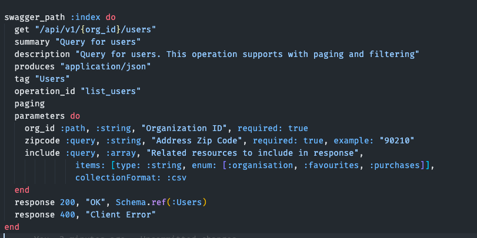

# Welcome-bits

 
 

**Welcome, dear \<reader>!**

**Every two weeks, we, the engineering team at Welcome to the Jungle, will share news about our tech products, as well as details about the technical topics we’ve been working on. Our newsletter, called Welcome Bits, will also include a curated list of the most interesting links we’ve found out there on the wild wild web.**

What is Welcome to the Jungle?

<a href="https://www.welcometothejungle.com/en">Welcome to the Jungle</a> is building the new experience at work. We use content and technology to transform every step of the employee experience, to help companies offer a better, more human experience in the workplace.

Why we decided to create Welcome Bits

  
Learning and sharing knowledge is part of the engineering team’s DNA. For example, since Welcome to the Jungle launched, Jungle Labs sessions have been organized each month so that developers in the team can spend some time away from their daily tasks to learn new stuff, grow technically, and share it with the rest of the team (which is not always an easy exercise for the shyest among us).

So it seemed obvious to us that we should extend this learning and sharing experience to the outside world—meaning you, dear readers. And we hope you will enjoy reading about what we’ve discovered as much as we enjoy writing about it!

The engineering team behind Welcome Bits

  
The team is currently made up of 14 developers, but we’re part of a bigger team called (no prizes for guessing) “the tech team,” which also encompasses product, data, design and QA people.

Welcome to the Jungle is based in Paris, France, but 65% of us are working in full remote mode, which means that some of us can code while enjoying a beautiful view of the mountains or ocean.

The engineering team is composed of back-end, full-stack, and front-end developers, as well as one DevOps engineer and one head of engineering. We are working with Elixir, Ruby, and React JS, among other technologies (you can check <a href="https://www.welcometothejungle.com/fr/companies/wttj/tech">our full stack</a> for more details).

If you want to know more about our team, and the tech team in general, take a look at <a href="https://youtu.be/9QAV5r-sFhI">the filmed interview with Kevin</a>, our beloved CTO.

*This newsletter is a new thing for us, so your suggestions, questions, and comments are more than welcome! Just send us an issue or pull request.*

# Welcome Bits #1

## Bits of learning

"Optimizing your database the right way is never a waste of time"

> Over the past couple of weeks, we have been experiencing 40-plus million IOPS on some of our databases. Our first instinct was to check if any microservice was responsible for the high throughput, then we investigated AWS replicas, and finally we went after all the releases made in the past 6 months to look for any breaking change. But the answer to our performance issues was not there. So we started to look closer at the databases. We identified a lack of optimization and relevant indexes, and started to log slow queries and implement pghero. After a few optimizations, we managed to halve the IOPS on our main database!

*Thomas, head of engineering*

## Bits of contents

1. [Pomerium](https://github.com/pomerium/pomerium) 

> I was looking for a way to install a VPN to access our preproduction environment. We currently need multiple logins and passwords to access it, which is painful, and some of my teammates have dynamic public IPs, so this kind of filter can't be used either. I already knew the solution OpenVPN but it required to install additional tools to be able to manage identity aspects and policies access. That's how I found out pomerium that seems promising, as it is more comprehensive and has a Kubernetes API proxy.

*Charles, DevOps, security and back-end engineer*

2. [The styled-components happy path](https://www.joshwcomeau.com/css/styled-components/) 

> I really like Josh Comeau's blog posts about React and CSS because they are at a time qualitative, simple and interactive. His article about the best practices for styled-components was in particular very useful to me as it presents ways to lighten and simplify CSS files thanks to CSS variables and single source of styles.

*François, front-end developer*

3. [Crypto-mining attack in my GitHub actions through Pull Request](https://dev.to/thibaultduponchelle/the-github-action-mining-attack-through-pull-request-2lmc)

> Attacks for personal benefits and spam pull requests on GitHub are unfortunately more and more frequent. In addition to be inconsistent with the open-source philosophy, it also increases open-source maintainers’ fatigue, leading sometimes to burn out.

*Maxime, back-end developer*

4. [Numerical Elixir and Elixir XLA bindings for CPU/GPU/TPU](https://github.com/elixir-nx/nx)

> Bla bla

*Stéphane, full-stack lead developer*

5. [A performance dashboard for Postgres](https://github.com/ankane/pghero)

> Bla bla

*Sébastien, full-stack developer*

## Bits of exploration

### Visual testing with the Cypress plugin

The team has recently spent some time during our Jungle Labs sessions exploring visual testing, as we would like to implement it on the [Welcome UI](https://github.com/WTTJ/welcome-ui) design system. More specifically, we would like to be able to visually test the displayed components on the Welcome UI documentation, knowing that components can occur on different documentation pages.

We chose to test the [Cypress plugin](https://docs.cypress.io/guides/tooling/visual-testing.html#Functional-vs-visual-testing), which allows us to automatize the visual tests. 

Here is our condensed feedback about the Cypress plugin:

#### Strengths
- Free of charge
- Easy implementation
- Unit snapshots of components
- Web browsers and screen-resolution sensitive

#### Limitations
- Too sensitive: 
Comparison is done pixel by pixel, so the results are sometimes random. A threshold could be implemented to reduce the sensibility, but it could hide true anomalies.
- Limited debugging:
Differential snapshots are useful to indicate that there is an issue, but they are not clear enough to help with the analysis of the difference.

#### A concrete example with the breadcrumb component
- A visual test is executed for each line of the table, followed by the application design being modified:

- Here is a snapshot of when a difference in the text of the breadcrumb component is found:

### APIs documentation with PhoenixSwagger and GitBook

#### Strengths
- Git-like versioning of the API
- Global documentation (API and tech documents, app setup, knowledge...)
- Nice UI
- Easy to set up

#### Limitations
- A lot of small UI/UX bugs
- We didn't find a way to set up one base_url for all the endpoints

#### Example of one PhoenixSwagger endpoint

#### The GitBook web UI

## Bits of good vibes

Our open-source customizable design system with React styled-components, styled-system and reakit, called [Welcome UI](https://github.com/WTTJ/welcome-ui), just reached 253 stars on GitHub! Don’t hold back from using it and/or contributing.

## Bits of jobs

There are currently 5 open positions in the engineering team:

[Engineering manager](https://www.welcometothejungle.com/en/companies/wttj/jobs/engineering-manager_paris)

[DevOps engineer](https://www.welcometothejungle.com/en/companies/wttj/jobs/devops-engineer_paris)

[Full-Stack developer (Elixir, Ruby, React JS)](https://www.welcometothejungle.com/en/companies/wttj/jobs/full-stack-developer-ruby-elixir-react-js_paris)

[Back-end developer (Elixir, Ruby)](https://www.welcometothejungle.com/en/companies/wttj/jobs/backend-developer-ruby-elixir_paris_WTTJ_9MP4PxM)

[Front-end developer (React JS, CSS-in-JS)](https://www.welcometothejungle.com/en/companies/wttj/jobs/frontend-developer-react-js-css-in-js_paris)

If you have any questions about the positions, send us an issue or pull request!

Thanks for reading. As we’ve said, please don’t hesitate to open an issue or pull request for any questions or comments you might have about the newsletter or one of the job vacancies. We will answer you as soon as we can.
